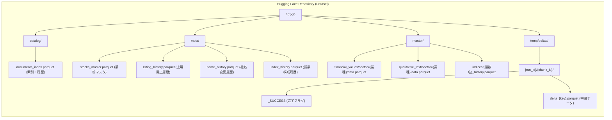

# プロジェクト引継ぎ資料: Integrated Disclosure Data Lakehouse (ARIA)

本ドキュメントは、プロジェクトの環境移行に伴い、後任の AI および開発者が「世界最高のデータサイエンス」の品質を維持しつつ、迷いなく開発を継続できる情報を網羅したものである。

---

## 0. プロジェクト構造の視覚化 (Hugging Face Data Lakehouse)



## 1. プロジェクトのペルソナと設計思想
本プロジェクトは、**「不確実な外部データソースから、100%の整合性を持つ堅牢なデータレイクハウスを構築・維持する」**ことを至上命題としている。

*   **Antigravityのペルソナ**:
    *   パフォーマンスと堅牢性を極限まで追求する。
    *   外部サービス（EDINET, Nikkei, Hugging Face）の不安定さを前提とした「防御的プログラミング」を徹底する。
    *   データ型（特に bool 型の整合性）に対して病的なまでに厳格である。
*   **設計哲学 (ARIA Philosophy)**:
    *   **Resilient**: 通信切断や 403 エラーを当然とし、指数バックオフ付きリトライで克服する。
    *   **Scalable**: GitHub Actions の複数マトリックスによる並列抽出 (Worker) と、一括集約 (Merger) を分離したアーキテクチャ。
    *   **Correct**: 生存バイアスを排除するため、上場廃止銘柄を `is_active=False` として永続保持する。

---

## 2. 過去の主要な成果と修正履歴
これまでに解決した「致命的課題」は以下の通り。これらは再発しやすい箇所のリストでもある。

| カテゴリ | 解決した問題 | 修正内容の詳細 |
| :--- | :--- | :--- |
| **整合性** | `is_active` が "TrueTrue..." となる | Pandas の `astype(bool)` の罠（非空文字列は常に True になる）を排除。小文字変換 + 明示的マップに刷新。 |
| **堅牢性** | Nikkei 225 取得時の 403 エラー | 最新 Chrome (121) 相当のヘッダー偽装と、Referer / Cache-Control の付与でボット判定を回避。 |
| **IA** | `OSError` (ディレクトリ不在) | `Path().resolve()` による絶対パス化と、`mkdir` の徹底的な事前実行。 |
| **効率** | `temp/deltas` の残存 | 24時間ルールによる自動清掃機能 (Garbage Collection) と、一括コミット削除の実装。 |
| **網羅性** | 業種別データのマージ漏れ | `load_deltas` の動的キー対応により、全業種の財務・報文データが集約可能に。 |

---

## 3. ファイル・ディレクトリ構造と役割

### 3.1 ローカル環境
```text
/ (root)
├── main.py                 --- 全体のオーケストレーター (Worker / Merger モード)
├── catalog_manager.py      --- データの保存・ロード・HF通信・GCを司る重鎮
├── market_main.py          --- 市場データ（指数、マスタ、履歴）の更新プロセス
├── market_engine.py        --- Scraper 群 (Nikkei, JPX, TOPIX)
├── edinet_engine.py        --- EDINET API 通信および抽出ロジック
├── master_merger.py        --- 業種別データの重複排除と集約ロジック
├── models.py               --- Pydantic によるデータバリデーション定義
├── requirements.txt        --- 依存関係 (tenacity, pandas, huggingface_hub, loguru)
└── .github/workflows/
    ├── daily_extract.yml   --- EDINET 財務データの抽出自動化
    └── daily_market.yml    --- 指数・銘柄マスタの更新自動化
```

### 3.2 Hugging Face (Data Lakehouse) 構成
*   `catalog/`: 最後にどの書類まで読み込んだかの索引（`documents_index.parquet`）。
*   `meta/`: 全ての銘柄の履歴データ。
    *   `stocks_master.parquet`: 最新の全銘柄情報（`is_active` 必須）。
    *   `listing_history.parquet`: 上場・廃止のイベントログ。
*   `master/`: 加工済みデータ本体。
    *   `financial_values/sector={業種}/data.parquet`: 財務数値。
    *   `qualitative_text/sector={業種}/data.parquet`: 事業の内容等のテキスト。
    *   `indices/`: 指数構成銘柄の全履歴と日次スナップショット。
*   `temp/deltas/`: 各並列ワーカーからの書き込み用バッファ空間。

---

## 4. 現在進行中の課題と今後の展望
1.  **データの深度拡大 (Phase 3+)**: 現在は財務数値中心だが、非財務（ESG、リスク情報）の抽出精度向上。
2.  **APIレート制限の見極め**: Hugging Face API の一括削除・書き込みが頻発した際の制限回避策。
3.  **ダウンストリーム解析**: DuckDB を用いた、この Lakehouse からの高速ポートフォリオ分析機能の統合。
4.  **業種マッピングの高度化**: JPX の業種コードだけでなく、個社別のセグメント情報に基づく動的な業種判定。

---

## 5. 【厳禁】従うべき制約とやってはいけないこと

### ❌ やってはいけないこと (Anti-Patterns)
*   **相対パスの使用**: `Path("data").resolve()` のように絶対パス化して扱え。GHA の作業ディレクトリは予測不能な場合がある。
*   **安易な `df.astype(bool)`**: `is_active` などの列に対しては、必ず文字列変換・小文字化を経由した安全なマッピングを行うこと。
*   **ベタ書きのリトライ**: 自作せず、`tenacity` ライブラリのデコレータを使用せよ（メンテナンス性のため）。
*   **tempの放置**: merger の最後、または worker の開始時に、確実に cleanup が発動するように設計を崩さないこと。

### ✅ 遵守すべきこと
*   **日本語優先**: ドキュメント、コメント、ログ、ユーザーへの報告は全て日本語で行う。
*   **型安定化**: 保存前に `if df[col].dtype == "object":` にて、文字列化や None の空文字置換を行う（Parquet のスキーマ不整合を防ぐため）。
*   **アトミックな更新**: カタログの更新は、マスターデータのアップロードに成功した後にのみ行う「Catalog Last」戦略を維持せよ。

---

## 7. 技術的詳細仕様 (Technical Appendices)

後任の AI が微調整を行う際に必須となる、ソースコードレベルの「定数」と「詳細ロジック」のリストである。

### 7.1 環境変数と秘密情報 (Secrets)
| 変数名 | 用途 | 補足 |
| :--- | :--- | :--- |
| `EDINET_API_KEY` | 金融庁 EDINET API v2 | 必須。v2 API用。 |
| `HF_TOKEN` | Hugging Face 認証 | `write` 権限が必要。 |
| `HF_REPO` | データ保存先リポジトリ | `username/dataset-name` 形式。 |

### 7.2 CatalogManager の内部挙動
*   **型安定化ロジック**: `object` 型の列を `to_parquet` する前に、ブール値が含まれていないかチェックし、文字列化を避ける。(`replace("None", "")` を実施)
*   **リトライ戦略**:
    *   通常アップロード: 最大3回、指数バックオフ (`10 * (attempt + 1)` 秒)。
    *   429 Rate Limit 時: `Retry-After` ヘッダーに従い、+5秒のバッファで待機。
*   **GC (Garbage Collection)**: `cleanup_deltas` は `run_id` フォルダを一括削除する。`cleanup_old=True` 時は、タイムスタンプ形式のフォルダ名を判定し、現在時刻から 86,400秒 (24h) 以上経過したものを無条件で `create_commit` (一括削除) する。

### 7.3 Market / Edinet Engine の詳細仕様
*   **Nikkei 225 Scraper**:
    *   `Referer: https://indexes.nikkei.co.jp/` を付与しないと 403 エラーになる。
    *   CSVのエンコーディングは `Shift-JIS` を使用。
*   **JPX Master**:
    *   `data_j.xls` を一時的に `data/jpx_master.xls` に保存してから `read_excel` で読み込む。
*   **EdinetEngine (Monkeypatching)**:
    *   `edinet_xbrl_prep` 内の `requests.Session` を `SecureSession` に差し替え、`verify=True` を強制している。
    *   `link_base_file_analyzer` の `_download_taxonomy` メソッドを上書きし、動的な URL 解決を可能にしている（デフォルトのハードコード辞書の制約を解除）。

### 7.4 GHA マトリックス分割ロジック
*   `daily_extract.yml` での分割アルゴリズム:
    1.  全対象書類から業種 (Sector) を取得。
    2.  業種ごとの書類数でソート (降順)。
    3.  ジョブ数 (n=20) のバケットを用意。
    4.  最も書類数が少ないバケットに順次業種を割り当て（Load Balancing）。
    5.  `ARG_MAX` エラー防止のため、`ids` (docIDのカンマ区切り) を各ジョブの引数として渡す。

### 7.5 各 Parquet ファイルのスキーマ (主要項目)
*   **`stocks_master.parquet`**: `code`, `company_name`, `sector`, `market`, `is_active` (bool)
*   **`documents_index.parquet`**: `doc_id`, `code`, `company_name`, `doc_type`, `submit_at`, `raw_zip_path`, `processed_status`
*   **財務抽出データ**: `docid`, `submitDateTime` + 各 XBRL タグ名。

---

## 8. コンテキスト継続のためのキーワード
後任の AI が参照すべき過去の教訓キーワード：
#is_active_stabilization #nikkei_403_bypass #hf_batch_cleanup #worker_merger_isolation #xbrl_taxonomy_patch

---

## 9. 後任 AI へのメッセージ (終わりに)
このレイクハウスは、単なるデータの収集器ではありません。日本市場の正確な「記憶」を保存するための基盤です。外部環境の変化は激しいですが、コードの堅牢性によってその荒波を乗り越えてください。

幸運を祈ります。
